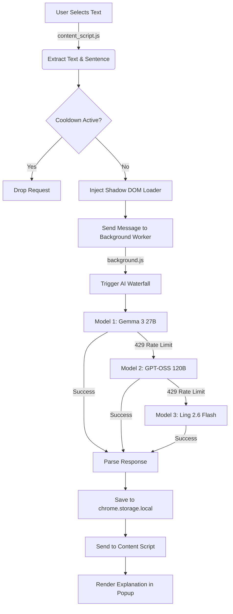

<div align="center">
  
  <h1>👁️ ContextLens</h1>
  <p><strong>Instant, context-aware AI explanations for any highlighted text on the web.</strong></p>
  <p><em>Developed Under MineLabs</em></p>

  [](https://developer.chrome.com/docs/extensions/mv3/)
  [](https://openrouter.ai/)
  [](https://github.com/catppuccin/catppuccin)
  [](https://opensource.org/licenses/MIT)
</div>

---

## 📖 Table of Contents

- [Overview](#-overview)
- [Key Features](#-key-features)
- [Deep Dive: The Architecture](#-deep-dive-the-architecture)
  - [Shadow DOM Isolation](#1-shadow-dom-isolation)
  - [The AI Waterfall Fallback System](#2-the-ai-waterfall-fallback-system)
  - [Smart Throttling & Rate Limiting](#3-smart-throttling--rate-limiting)
- [Dashboard & History Vault](#-dashboard--history-vault)
- [Project Structure](#-project-structure)
- [Installation Guide](#-installation-guide)
- [Usage Instructions](#-usage-instructions)
- [Privacy & Security](#-privacy--security)
- [Roadmap](#-roadmap)

---

## 🌟 Overview

**ContextLens** is a next-generation browser extension designed to eliminate friction while reading complex materials online. Instead of forcing users to open a new tab and search for terms they don't understand, ContextLens brings the explanation directly to the cursor. 

By leveraging the cutting-edge **OpenRouter API** and a highly resilient multi-model fallback chain, ContextLens provides instant, zero-cost, context-aware definitions of any selected text. Developed under **MineLabs**, this tool is engineered for performance, precision, and a premium user experience.

---

## ✨ Key Features

- **🚀 Instant Contextual Explanations**: ContextLens doesn't just define a word; it analyzes the *surrounding sentence*. This means words with multiple meanings are explained correctly based on their specific context on the page.
- **🛡️ Shadow DOM Isolation**: The "Ghost Popup" UI is injected directly into the DOM using Shadow Root. This guarantees **zero CSS conflicts** with the host website—no broken layouts, overridden fonts, or clashing colors.
- **🧠 Resilient AI Waterfall Chain**: Powered by OpenRouter's free tier, the extension seamlessly switches between top-tier AI models if one becomes overloaded or unavailable, ensuring near 100% uptime.
- **🗂️ History Vault Dashboard**: A standalone, beautifully crafted dashboard (using the Catppuccin Mocha color palette) that logs your past lookups. It features real-time search, category filtering, and lookup statistics.
- **⚡ Smart Rate Limiting**: An intelligent cooldown mechanism prevents API abuse, ensuring that rapid text selections don't trigger IP bans or quota exhaustion.

---

## 🏗️ Deep Dive: The Architecture

ContextLens is built strictly on **Chrome Manifest V3 (MV3)**, utilizing Service Workers and Content Scripts to create a lightweight, non-blocking experience.



### 1. Shadow DOM Isolation
When text is highlighted, `content_script.js` calculates the bounding box of the selection and dynamically creates a custom HTML element. To prevent the host page's CSS (like Wikipedia or Medium) from overriding the popup's styling, the UI is attached inside a `#shadow-root`. This creates an impenetrable boundary protecting the premium Catppuccin design.

### 2. The AI Waterfall Fallback System
Relying on a single free-tier AI API often leads to downtime during peak hours. ContextLens solves this with a **Waterfall Fallback Engine** located in `background.js`. 
- **Slot 0 (Primary)**: `google/gemma-3-27b-it:free` — Chosen for its high speed and strict adherence to formatting instructions.
- **Slot 1 (Fallback 1)**: `openai/gpt-oss-120b:free` — A highly capable reasoning model that steps in if Gemma is rate-limited.
- **Slot 2 (Fallback 2)**: `inclusionai/ling-2.6-flash:free` — A blazing-fast, lightweight model to guarantee an answer.
- **Slot 3 (Emergency)**: `google/gemma-4-31b-it:free` — Kept in reserve.

The Service Worker tracks the `activeModelIndex` in memory. If a model succeeds, it becomes the new default for subsequent requests, dramatically reducing latency by skipping known-failing models.

### 3. Smart Throttling & Rate Limiting
Because free API tiers have strict requests-per-minute (RPM) limits, `content_script.js` implements a strict **2.5-second cooldown guard**. If a user rapidly selects multiple sentences in a row, the extension safely ignores the excess requests, preventing the extension from being globally rate-limited by OpenRouter.

---

## 🗂️ Dashboard & History Vault

The ContextLens Dashboard (`dashboard.html`) acts as your personal knowledge base.

- **Offline Storage**: All lookups are stored locally using `chrome.storage.local`. No data is sent to external databases.
- **Dynamic Analytics**: See your total lookups, lookups done today, and your most frequently queried category (e.g., TECH, MEDICAL, LEGAL).
- **Categorization**: The AI automatically tags every explanation. The dashboard allows you to filter your history by these tags instantly.
- **Instant Search**: A debounced search bar allows you to instantly find past lookups by keywords.

---

## 📁 Project Structure

```text
Context Lens/
├── manifest.json          # Core MV3 configuration and permissions
├── background.js          # Service worker: AI API calls, waterfall logic, JSON parsing
├── content_script.js      # DOM manipulation: Text selection, Shadow DOM injection
├── dashboard.html         # History Vault markup
├── dashboard.css          # Catppuccin Mocha styling for the dashboard
├── dashboard.js           # Logic for History Vault (Search, Filter, Render)
└── icons/                 # 16x16, 48x48, 128x128 extension icons
```

---

## 🚀 Installation Guide

ContextLens is currently available as an unpacked extension for developers and early adopters.

### Prerequisites
1. A Chromium-based browser (Google Chrome, Brave, Edge, Arc).
2. (Optional) Your own free API key from [OpenRouter](https://openrouter.ai/). A working key is provided by default.

### Setup Instructions
1. **Clone the Repository**:
   ```bash
   git clone https://github.com/Himanshu-Vishwakarma-GH/Context-Lens.git
   ```
2. **Load the Extension**:
   - Open your browser and navigate to `chrome://extensions/`.
   - Toggle **Developer mode** ON (usually in the top right corner).
   - Click the **Load unpacked** button.
   - Select the `Context Lens` folder from your local machine.
3. **Pin the Extension**: Click the puzzle piece icon in your browser toolbar and pin ContextLens for easy access to your History Vault.

---

## 💡 Usage Instructions

1. **Read & Select**: Browse any article, documentation, or webpage. Use your mouse to highlight a confusing word, acronym, or phrase.
2. **Instant Explanation**: A sleek popup will appear near your cursor. It will display a loading pulse while querying the AI, and then instantly reveal the definition and its category.
3. **Dismiss**: Click anywhere outside the popup, or press the `Escape` key to close it.
4. **Review History**: Click the ContextLens icon in your browser toolbar. This opens the History Vault where you can search, filter, and copy previous explanations.

---

## 🔒 Privacy & Security

MineLabs takes privacy seriously. ContextLens is designed with a **Zero-Telemetry** architecture.

- **No Remote Databases**: Your lookup history never leaves your device. It is stored exclusively in your browser's local `chrome.storage`.
- **Strict Content Security Policy (CSP)**: The extension uses local fonts and strict CSP rules to prevent cross-site scripting (XSS) attacks.
- **Minimal Permissions**: 
  - `storage`: Only used for the History Vault.
  - `scripting` & `<all_urls>`: Only used to detect highlighted text and inject the isolated popup.

---

## 🗺️ Roadmap

- [ ] **PDF Support**: Enable ContextLens to work inside local and web-hosted PDF viewers.
- [ ] **Custom Prompts**: Allow users to customize the length and tone of the explanations (e.g., "Explain like I'm 5").
- [ ] **Translation Mode**: Auto-detect foreign languages and provide localized translations alongside explanations.
- [ ] **Sync Storage**: Optional opt-in to sync lookup history across multiple devices using Chrome Sync.

---

<div align="center">
  <p>Built with ❤️ and ☕ by <b>MineLabs</b></p>
  <p><em>Empowering readers to understand the web, instantly.</em></p>
</div>
